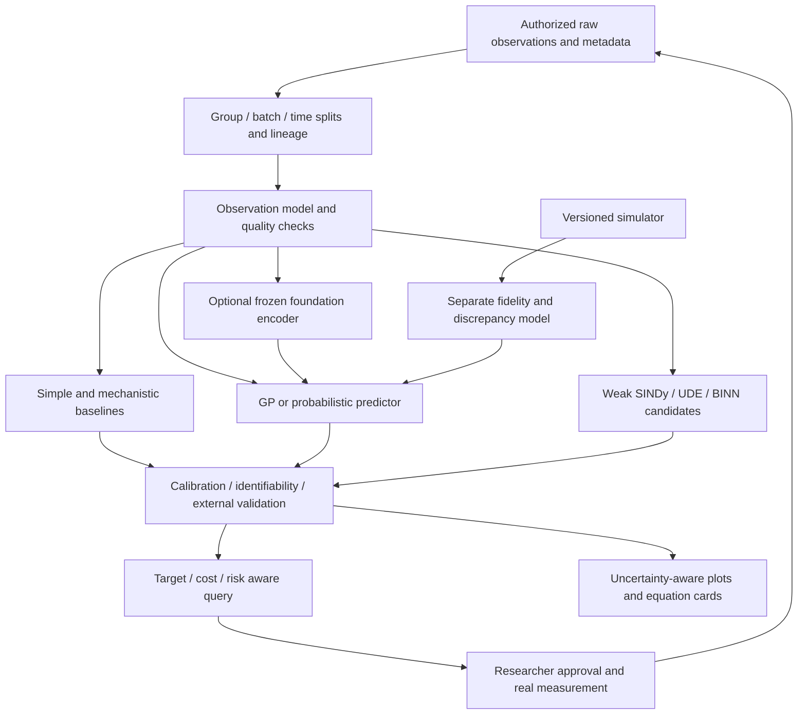

# Proposed architecture: separate observations, assumptions, and interventions

**Status: literature-informed design proposal. The complete system has not been implemented or validated.**

## 1. Separation of responsibilities

Do not assign collection, correction, prediction, and mechanistic explanation to one opaque predictor. Separate an observation layer, a predictive/mechanistic layer, a next-experiment decision layer, and a validation layer that limits the claims. Independently implemented modules must share sample identifiers, lineage, units, and an uncertainty representation.

Not every branch should be active. Image annotation may not need dynamics; a known small ODE may not need a foundation encoder. Add a module only when its assigned role improves on independently held-out real data.

## 2. Define the observation process first

For subject s, modality m, and time t, one possible formulation is

$$
z_s'(t)=f_M(z_s(t),u_s(t);\theta_s),\quad
\theta_s\sim p(\theta\mid\eta),
$$
$$
y_{smt}\sim p_m\{y\mid H_m[z_s(t)],b_s,b_{batch},\psi_m\}.
$$

Here `H_m` is the observation operator and `psi_m` represents acquisition, noise, and sampling parameters.

| Raw measurement | Distinction from state | Candidate observation model | Invalid shortcut |
|---|---|---|---|
| Fluorescence intensity | Background, saturation, bleaching, optical mixing | Intensity likelihood plus mask uncertainty | Equating intensity with cell count |
| RNA counts | Library size, sampling and biological zeros | Count likelihood and batch/donor effects | Saving a Gaussian-corrected value as a measurement |
| Calcium trace | Indicator dynamics differ from spikes | Latent events/state plus observation filter | Interpreting its derivative as membrane-voltage dynamics |
| EEG voltage | Reference, conduction, mixing, artifacts | State-space or representation-based model | Inferring unique neuronal wiring directly |

These are modeling candidates, not universal generating laws. Check likelihood adequacy with residuals, replicates, and held-out groups. Do not equate all missing omics values with biological zeros or interpret a learned interpolation as a measured time series.

## 3. Route by mechanistic knowledge

**Known mechanism:** integrate the ODE/PDE with a conventional solver and fit a measurement likelihood. A neural method must beat this baseline.

**Partial mechanism:** start with `f_M=f_known+delta`, using a small constrained GP or neural discrepancy. Check profile likelihoods or posterior ridges and whether the residual substitutes for a known mechanistic term. Biological UDE flexibility is not synonymous with identifiability. [R10](../../references/BIBLIOGRAPHY.md#r10)

**Unknown mechanism, observed state:** compare weak-form sparse discovery with restricted symbolic search. Specify dimensional, sign, positivity, and conservation constraints. Separate fit error from rollout error. [R04](../../references/BIBLIOGRAPHY.md#r04) [T02](../../references/BIBLIOGRAPHY.md#t02)

**Partial or unknown state:** consider a state-space model or simulation-based inference first. A compact equation in arbitrary learned coordinates is not automatically a law about named molecules or neurons. Neural simulator parameter-distribution inference is an established use of SBI. [R25](../../references/BIBLIOGRAPHY.md#r25)

An unrestricted sum `f_known+f_symbolic+NN+GP` lets multiple modules explain the same behavior. Assign a primary explanatory role; constrain residual complexity and magnitude, and record parameter compensation.

## 4. Model contracts

| Field | Example | Purpose |
|---|---|---|
| Target estimand | Mean 24-hour response of a new donor | Prevent target drift |
| Observation operator | Assumptions mapping counts to density | Separate measurement and state |
| Valid domain | Concentration, time, tissue, device ranges | Mark extrapolation |
| Prior register | Fixed conservation law versus estimated kinetic law | Identify assumptions that may be wrong |
| Parameter identity | Identified / combination only / unchecked | Prevent overinterpretation |
| Uncertainty scope | Observation / parameter / model | State what intervals include |
| Data lineage | Raw observations and release hash | Detect leakage and synthetic circularity |
| Evidence status | Candidate / prediction-validated / mechanism-supported | Separate levels of claim |

Do not award `mechanism-supported` from one statistical threshold. It is an explicit research status requiring interventions, observability, alternative-model discrimination, and domain review as appropriate.

## 5. Extend acquisition beyond the next input point

Define a query q as `(condition, time, readout, intervention, fidelity, replicate, group)`. First choose whether the target Θ_T is a parameter, optimum, or unobserved response.

A proposed information-oriented heuristic is

$$
q^*=\arg\max_{q\in\mathcal Q_{allowed}}
\frac{I(\Theta_T;Y_q\mid D)}{C_{assay}(q)+C_{label}(q)+C_{compute}(q)}.
$$

Costs must share an agreed unit. This is not a new universally optimal acquisition theorem. Compare it with direct predictive-risk reduction or decision-utility approaches. Model disagreement can suggest discriminating experiments, but all models may share a blind spot.

Operational safeguards include duplicate removal, batch diversity, replication budgets, researcher approval, and an independent exploration arm. A model-derived safety probability is not a safety guarantee. Research approvals, equipment limits, and biological risk review determine the allowed experiment space before optimization.

## 6. Propagate uncertainty between modules

Passing only preprocessing point estimates makes segmentation and interpolation errors appear to vanish. Candidate interfaces are posterior-sample bundles or means and covariances with their validity limits. For example, derive density trajectories from alternative segmentations and compare the equations fitted across those trajectories. An ensemble still requires a check that it covers relevant error sources; shared bias can produce small disagreement.

Conformal intervals can provide an additional calibration layer. Specify exchangeability, adaptive selection, input-density ratios, and whether the conditional outcome distribution changes. The label “split conformal” does not establish arbitrary out-of-distribution or per-subject guarantees. [R23](../../references/BIBLIOGRAPHY.md#r23) [R24](../../references/BIBLIOGRAPHY.md#r24)

## 7. An information-budget check for synthetic data

Suppose a generator is fitted to real data D and produces S. If generator randomness is independent of the unknown biological target Θ conditional on D, then `Θ → D → S` and

$$ I(\Theta;S\mid D)=0. $$

Thus S supplies no additional independent observational evidence beyond D. Augmentation can nevertheless improve regularization, optimization, or representation learning for a limited learning algorithm. If external pretraining or mechanistic knowledge E contributes, `(D,E)` is the information source and E belongs in the budget. This is a conditional information-structure argument, not a blanket impossibility result for generative learning.

Operationally, retain higher evidentiary status for original measurements and record parent identifiers, generator version, fitting split, seed, units, and transformation. Display synthetic-only and real-data performance separately.

## 8. Visualization contract

Prioritize measured points with predictive intervals, group-specific residuals, learning curves against cost, coverage together with interval width, out-of-domain error, equation Pareto fronts, identifiable coefficient combinations, and proposed discriminating experiments. UMAP/t-SNE are exploratory displays. Disclose whether validation/test data were used to refit projections or scales and how that affects evaluation.

Every plot should state provenance, independent-unit count, model version, interval type, and units. Distinguish observations from imputed or generated trajectories. If a discovered equation cannot be mapped back to observed variables, label it a latent-space equation.
