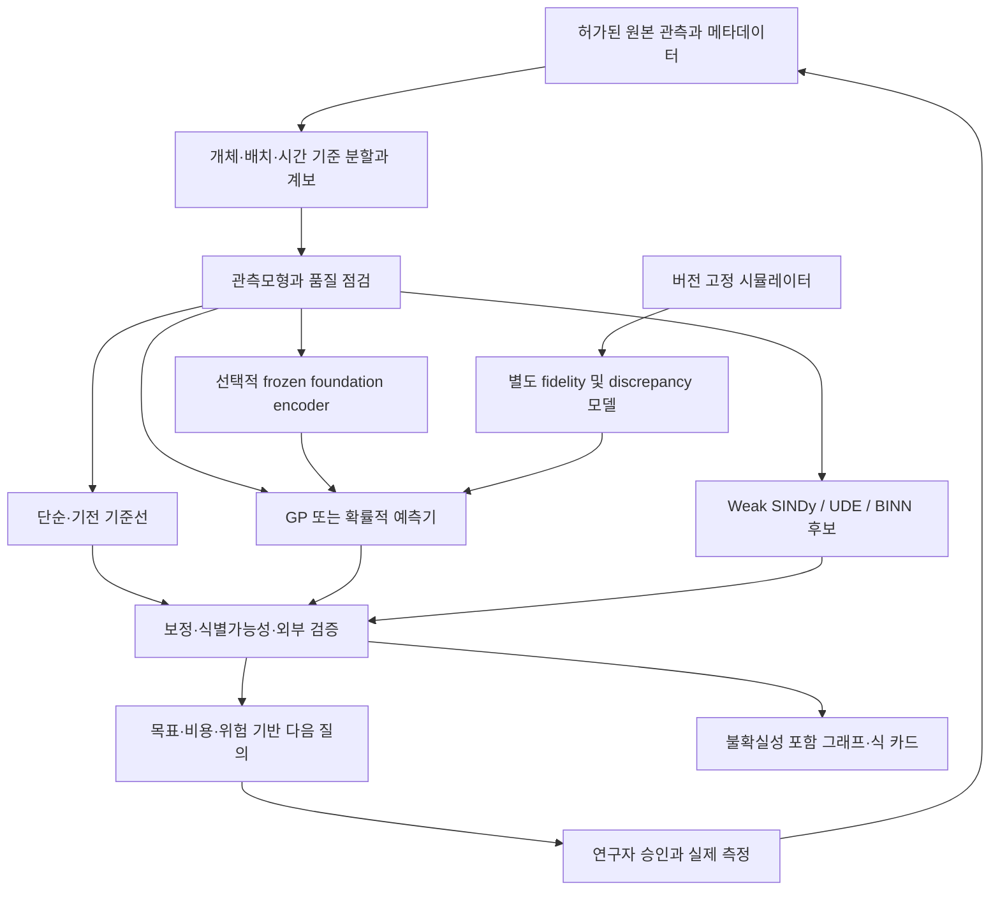

# 제안 아키텍처: 관측·가정·개입을 분리하는 폐루프

**상태: 문헌을 바탕으로 한 설계 제안. 전체 시스템은 구현·실증되지 않았다.**

## 1. 구성 원칙

예측용 대형 모델 하나에 수집·보정·기전 설명까지 맡기지 않는다. 데이터의 생성 과정을 설명하는 관측 계층, 예측 또는 기전을 담당하는 모델 계층, 다음 비용 지출을 결정하는 실험설계 계층, 결과의 주장 범위를 정하는 검증 계층을 분리한다. 독립 구현체라도 `sample_id`, 데이터 계보, 단위, uncertainty representation을 공유해야 한다.

모든 가지를 항상 켜는 구조는 아니다. 영상 라벨링에는 동역학 모듈이 불필요할 수 있고, 이미 알려진 간단한 ODE에는 foundation encoder가 불필요하다. 기능 추가는 held-out 실제 데이터에서 그 역할의 이득이 확인된 경우에만 한다.

## 2. 관측모형을 먼저 정의한다

개체 s, 모달리티 m, 측정시점 t의 잠재 상태를 z라 할 때 예시는 다음과 같다.

$$
z_s'(t)=f_M(z_s(t),u_s(t);\theta_s),\quad
\theta_s\sim p(\theta\mid\eta),
$$
$$
y_{smt}\sim p_m\{y\mid H_m[z_s(t)],b_s,b_{batch},\psi_m\}.
$$

`H_m`은 관측 연산자이며 `psi_m`은 장비·잡음·샘플링 파라미터이다. 이 설계에서는 다음을 서로 바꾸어 쓰지 않는다.

| 원 관측 | 잠재 상태와의 차이 | 모델링 후보 | 잘못된 지름길 |
|---|---|---|---|
| 형광 영상 intensity | 배경, 포화, 광퇴색, 광학적 혼합 | intensity likelihood와 마스크 불확실성 | intensity를 세포 수로 단정 |
| RNA count | library size, sampling, dropout 해석 | count likelihood와 배치·개체 효과 | 임의 Gaussian 보정값을 실측으로 저장 |
| calcium trace | spike와 indicator dynamics가 다름 | latent spike/continuous state + 관측 필터 | calcium 변화율을 막전위 ODE로 해석 |
| EEG voltage | reference·전도·혼합·artifact | 상태공간/표현 기반 모형 | 채널별 파형으로 뉴런 연결을 직접 확정 |

표는 구현 후보이지 모든 데이터의 확정 생성모형이 아니다. 선택한 관측 우도의 적합성은 잔차, 반복 측정, held-out 집단에서 검증한다. 오믹스의 결측을 모두 생물학적 0으로 읽거나, 학습한 보간을 실제 시계열로 간주하지 않는다.

## 3. 기전의 확실성에 따라 모델을 선택한다

**Known mechanism:** 검증된 ODE/PDE를 일반 수치해석기로 적분하고 관측 우도로 계수를 추정한다. Neural method가 이 기준선을 이겨야 한다.

**Partial mechanism:** `f_M=f_known+delta`를 쓰되, discrepancy는 작고 제한적인 GP/NN으로 시작한다. 계수의 profile likelihood 또는 posterior ridge를 확인하고, NN이 기존 기전 항을 대체하는지 점검한다. 생물학적 UDE에서 유연성이 곧 식별가능성은 아니다. [R10](../../references/BIBLIOGRAPHY.md#r10)

**Unknown mechanism but observed state:** weak-form sparse discovery 또는 제한 연산자의 symbolic search를 비교한다. 단위·부호·양성·보존 제약을 명시하고, fitting error와 rollout error를 분리한다. [R04](../../references/BIBLIOGRAPHY.md#r04) [T02](../../references/BIBLIOGRAPHY.md#t02)

**Unknown or partially observed state:** 먼저 상태공간모형이나 simulator-based inference를 검토한다. 숨은 상태를 임의 latent coordinate로 만든 후, 그 좌표의 짧은 식을 실제 분자·뉴런의 법칙처럼 부르지 않는다. 신경 시뮬레이션의 파라미터 분포 추정은 SBI의 검증된 사용 방향이다. [R25](../../references/BIBLIOGRAPHY.md#r25)

모든 후보를 `f_known+f_symbolic+NN+GP`처럼 무제한 더하면 동일한 현상을 여러 모듈이 설명한다. 주된 역할을 하나 정하고, 잔차의 복잡도·크기 제한과 파라미터 보상 관계를 함께 기록한다.

## 4. 가정과 불일치를 기록하는 모델 계약

각 모델 artifact에는 다음 필드가 필요하다.

| 필드 | 예시 | 필요한 이유 |
|---|---|---|
| Target estimand | 새 기증자의 24h response 평균 | 예측 대상 혼동 방지 |
| Observation operator | count-to-density 변환의 가정 | 측정과 상태 분리 |
| Valid domain | 농도·시간·조직·장비 범위 | 외삽 영역 표시 |
| Prior register | 고정 보존법칙 / 추정 kinetic law | 틀릴 수 있는 가정 식별 |
| Parameter identity | 식별 가능 / 조합만 가능 / 미확인 | 숫자의 과도한 해석 방지 |
| Uncertainty scope | observation / parameter / model | 구간이 포괄하는 오차 명시 |
| Data lineage | 원 관측 및 training release hash | 누수·합성 순환 추적 |
| Evidence status | candidate / validated-prediction / mechanism-supported | 주장 수준 분리 |

`mechanism-supported`는 통계적 문턱 하나로 자동 부여하지 않는다. 독립 개입, 관측 가능성, 대안 기전과의 구분, 분야 전문가 검토가 필요한 명시적 연구 상태이다.

## 5. 획득 함수의 확장: 무엇을, 언제, 어떻게 다시 측정할 것인가

질의 q를 `(condition, time, readout, intervention, fidelity, replicate, group)`로 정의한다. 타깃 변수 Θ_T가 파라미터인지, 최적 조건인지, 미관측 response인지 먼저 고른다.

제안하는 정보 중심 heuristic은

$$
q^*=\arg\max_{q\in\mathcal Q_{allowed}}
\frac{I(\Theta_T;Y_q\mid D)}{C_{assay}(q)+C_{label}(q)+C_{compute}(q)}
$$

이다. 비용은 금전 또는 사전 합의된 동일 단위로 환산한다. 이는 모든 목표를 해결하는 새로운 획득 정리가 아니다. 예측 위험 감소나 기대 의사결정 효용을 직접 쓰는 별도 acquisition과 비교한다. 모델 간 의견 차이는 후보 기전이 구분되는 실험을 찾는 지표가 될 수 있지만, 모든 모델이 같은 가정을 틀리면 차이가 작을 수 있다.

운영 제안은 중복 질의 제거, batch diversity, 재현 실험의 최소 예산, 연구자 승인, 순수 탐색 대조군이다. 모델이 계산한 안전확률은 실제 안전성을 보증하지 않는다. 실험 가능 범위는 연구 승인·장비 한계·생물학적 위험 검토가 먼저 정하며, 모델은 그 안에서만 선택한다.

## 6. 불확실성을 파이프라인 전체에 전달

전처리의 point estimate만 GP나 SINDy에 넘기면 마스크·보간 오차가 사라진 것처럼 보인다. 가능한 계약은 posterior sample 묶음 또는 평균·공분산과 그 유효범위이다. 예를 들어 segmentation 후보별 cell-density trajectory를 만들고, 여러 궤적에서 추정된 식의 차이를 보고한다. 다만 ensemble이 모든 오차원을 포함하는지 검증해야 하며, 동일 편향 모델의 분산이 작다는 이유로 확신하지 않는다.

Conformal 구간은 추가 보정 수단이다. 교환가능성, 적응적 질의, 입력분포 비율, 조건부 분포 변화 여부를 먼저 명시한다. 표준 split conformal의 이름만으로 OOD 보장이나 개체별 보장을 부여하지 않는다. [R23](../../references/BIBLIOGRAPHY.md#r23) [R24](../../references/BIBLIOGRAPHY.md#r24)

## 7. 합성 데이터의 정보 예산: 자체 논리적 점검

실제 데이터 D로 생성기를 학습하고 그 생성물 S를 얻는다고 하자. 알 수 없는 생물학적 대상 Θ와 생성 난수가 D를 조건으로 독립이면 `Θ → D → S`이며,

$$ I(\Theta;S\mid D)=0. $$

즉 S는 D에 없는 **추가적인 독립 관측 증거**를 제공하지 않는다. 이것은 증강이 쓸모없다는 뜻이 아니다. 제한된 학습 알고리즘에는 regularization, 최적화, 표현 학습상의 이득을 줄 수 있다. 외부 사전학습·법칙·시뮬레이터 지식 E가 들어가면 `(D,E)`가 정보 출처이며 E를 예산에서 숨겨서는 안 된다. 이 단락은 위 조건에서의 정보 구조에 관한 논리적 해석이지 생성 AI 전반의 불가능성 정리가 아니다.

실무에서는 원 관측을 더 높은 권위로 두고 `parent_ids`, 생성기 버전, 학습 split, seed, 단위, 변환 종류를 기록한다. synthetic-only 성능은 real-data 성능과 별도 패널로 표시한다.

## 8. 시각화 계약

관측 산점도와 예측선·구간, 집단별 잔차, 비용 대비 학습곡선, coverage와 interval width, OOD 오차, 후보식 Pareto plot, 식별가능한 계수 조합, 반증 실험의 기대 구분력을 우선 표시한다. UMAP/t-SNE는 탐색 보조로만 쓴다. validation/test 데이터를 사용해 projection이나 스케일을 다시 맞추는 경우 그 목적과 누수 영향을 명시한다.

모든 그래프에 데이터 출처, 독립 개체 수, 모형 버전, 구간 종류, 단위가 있어야 한다. 관측과 보간·생성 궤적은 범례에서 구분한다. 학습한 식을 원 변수로 되돌릴 수 없으면 latent-space equation임을 표시한다.
