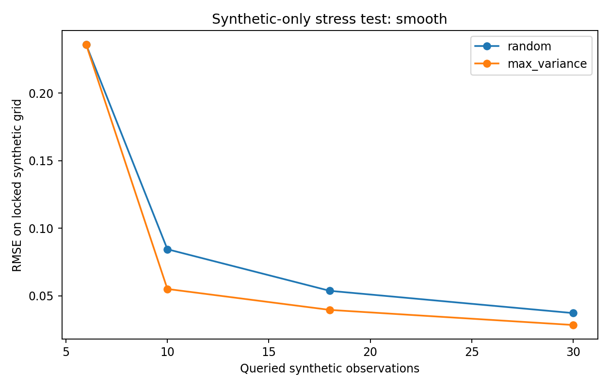
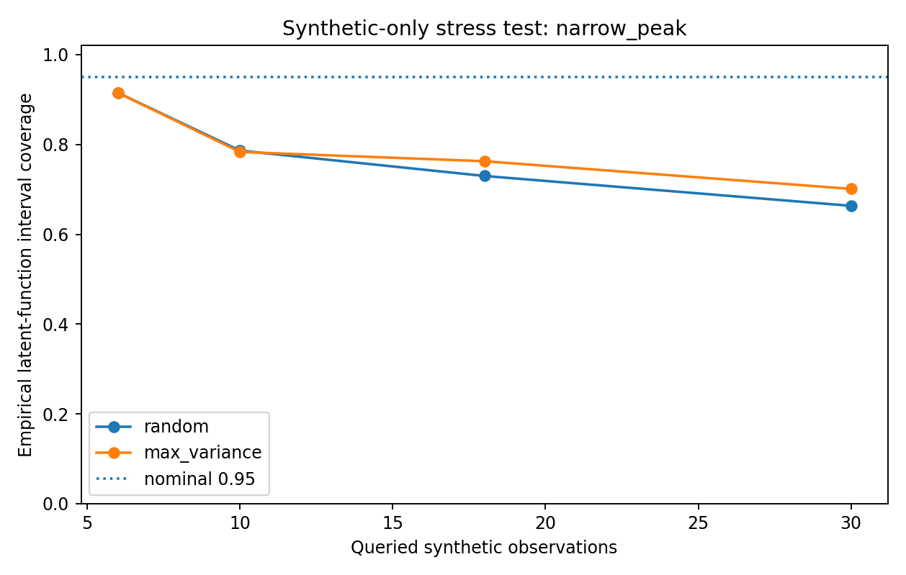

# 합성 예제 실행 결과

20 seeds, 동일 초기점·노이즈·예산. 표는 **30회 질의**에서의 평균이다. 생물학적 표본 0개이며 실제 연구 성능 비교가 아니다.

| Scenario | Policy | RMSE mean | RMSE SD | Latent 95% coverage | Mean width |
|---|---|---:|---:|---:|---:|
| smooth | random | 0.03719 | 0.01360 | 94.31% | 0.13674 |
| smooth | max_variance | 0.02838 | 0.00795 | 97.14% | 0.12669 |
| narrow_peak | random | 0.18809 | 0.01929 | 66.34% | 0.13674 |
| narrow_peak | max_variance | 0.17636 | 0.01465 | 70.11% | 0.12669 |

## 해석

두 함수에서 max-variance 정책의 평균 RMSE가 더 작았다. 그러나 narrow-peak 조건에서는 두 정책 모두 명목 95%보다 훨씬 낮은 경험적 포함률을 보였다. 데이터가 늘면 구간은 좁아져도 모형 편향이 남을 수 있다. 이는 fixed-kernel 예제에 대한 관찰이며 AL이나 GP 전체의 우월성·열등성을 입증하지 않는다. kernel hyperparameter를 실제 문제에 맞춰 선택하는 경우 결과는 달라질 수 있다.

그림의 coverage는 하나의 고정 함수의 test grid와 noise seeds에 대한 진단이다. 빈도주의적 모집단 coverage 증명이 아니며 새 측정값의 predictive interval과도 다르다. 통계적 유의성 검정을 수행하지 않았다.

[모든 실행 기록](results/runs.json) · [집계](results/summary.json) · [환경](results/environment.json) · [식별가능성 반례](results/identifiability.json)
